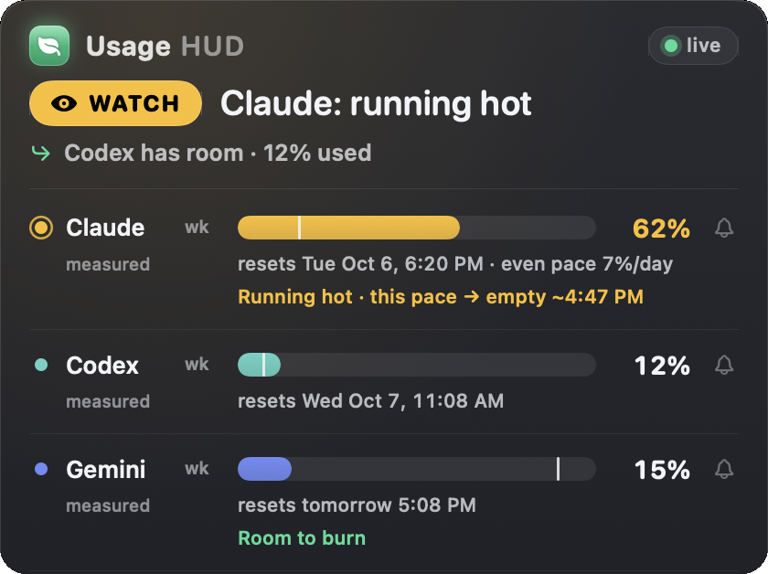

# Usage HUD

**Which AI subscription has room right now?** Usage HUD answers that in your Mac menu bar. One verdict for Claude, Codex, Gemini, Grok and local models: who is running hot, when it runs out at this pace, and which tool you can switch to.

**[Download for Mac (free)](https://github.com/Thalia-Bloom/usage-hud/releases/latest/download/UsageHUD.zip)** · Apple silicon and Intel · macOS 14+ · signed and notarized by Apple

Free. If it saves you a stalled afternoon, you can [leave a tip](https://hud.thaliabloom.com/#tip).

## What you see

- **One verdict.** "Claude: running hot" with the next move under it: "Codex has room · 22% used".
- **Pace, not just percent.** A tick on each bar marks how much of the window has passed. Ahead of it, the lane says when it runs dry: "this pace → empty ~4:31 PM".
- **Reset times on every lane,** and a bell that pings you when a window comes back.
- **An honest label on every number:** official, measured or estimated. Old readings say how old they are instead of passing as live.
- **Local models count too:** token totals from your Ollama logs, today and this week.

## Built on trust

- Everything stays on your Mac. No account, no analytics, no browser cookies.
- Claude numbers come from the same usage endpoint Claude Code's own `/usage` panel reads. Usage HUD never refreshes or changes your Claude Code sign-in.
- Codex numbers come from Codex's own quota and your local session logs.
- `codex-usage-doctor` tells you in plain English whether each number is reliable and why.

## Install

1. [Download the disk image](https://github.com/Thalia-Bloom/usage-hud/releases/latest/download/UsageHUD.dmg) and drag **Usage HUD** to Applications. Prefer the terminal? `curl -fsSL https://hud.thaliabloom.com/install.sh | bash`
2. Open it. It lives in the menu bar (no Dock icon).
3. The first run sets itself up: it finds your coding tools, hides the ones you don't have, and takes the first reading in about 10 seconds. No terminal. Or tell your coding agent "Usage HUD is installed, set it up" and it runs `usage-hud setup` for you.

Details and troubleshooting: [INSTALL.md](INSTALL.md).

## Requirements

- Any Mac on macOS 14 or later, Apple silicon or Intel.
- Claude Code or Codex signed in on this Mac. Nothing else to install for those two.
- Gemini (Antigravity CLI) and Grok lanes need Node.js 18 or later.
- The Local lane reads Ollama's logs.

## Usage HUD or CodexBar?

[CodexBar](https://github.com/steipete/CodexBar) is free, open source and covers far more tools. If you want every provider, use it. Usage HUD does less on purpose: it reads the few subscriptions most people code with and turns them into one calm answer about what to use next.

## FAQ

**Is it really free?** Yes. No trial, no license key, no account. Tips keep it maintained.
**Why did my weekly usage jump?** The weekly cap is separate from the 5-hour window and can move from other Claude clients on the same plan. [Why weekly usage jumped](https://hud.thaliabloom.com/why-weekly-usage-jumped/).
**Is the source available?** Not yet. This repository holds releases and the install guide.
**Support?** support@thaliabloom.com

Thalia Bloom · support@thaliabloom.com
