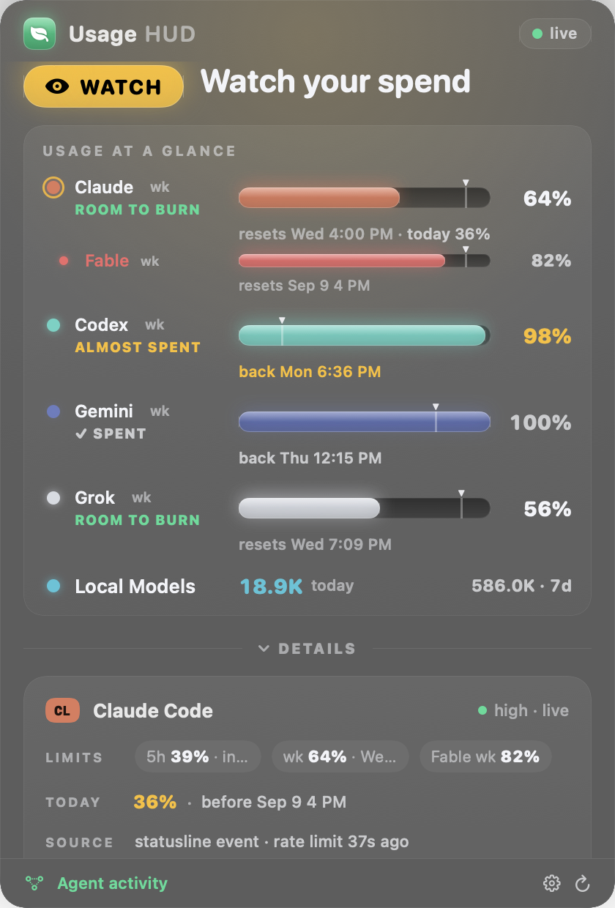

# Usage HUD

**One menu-bar meter for every AI subscription you code with.** Codex, Claude, Gemini, Grok and local models. See how much of each 5-hour and weekly window is used, when it resets, and whether the number can be trusted.

**[Buy for $9](https://usage-hud-store.pattern-service.workers.dev)** · launch price through Sep 30, then $15 · one-time · personal license · updates through 1.x · 14-day refund by email

## What you see

- One bar per provider, the reset time, and a freshness stamp. Turn a provider off without deleting its history.
- A confidence label on every number: official, high, medium, or manual, with a one-line reason.
- Local models: exact token counts from your Ollama logs, today and the rolling seven days.

## Built on trust

- Everything is collected on your Mac. Nothing is sent to us. There is no account and no telemetry.
- Claude numbers come from the same usage endpoint Claude Code's own `/usage` panel reads. The HUD never refreshes or changes your Claude Code token.
- Codex numbers come from your local Codex session logs, labeled as local telemetry, not billing.
- `codex-usage-doctor` tells you in plain English whether each number is reliable and why.

## Requirements

Apple silicon Mac, macOS 14 or later. For each lane you want: Claude Code signed in, Codex CLI, Gemini CLI, or Ollama. Node.js for the Codex, Gemini and Grok lanes; Python 3 for the Claude lane.

## Install

Unzip, move to Applications, open. The app is signed with a Developer ID and notarized by Apple, so macOS opens it without a warning. Then click Set up in the panel: it finds your coding tools, hides the ones you don't have, and collects the first reading. No terminal. Details in [INSTALL.md](INSTALL.md).

## FAQ

**Is the source available?** Not yet. This repository is the product page and the install guide.
**Refunds?** Email support@thaliabloom.com within 14 days.
**License?** Personal. Use it on the Macs you own.

Bloom Web Services LLC · support@thaliabloom.com
